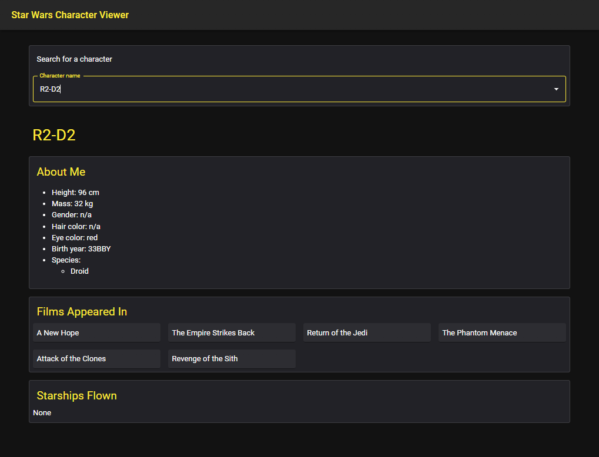
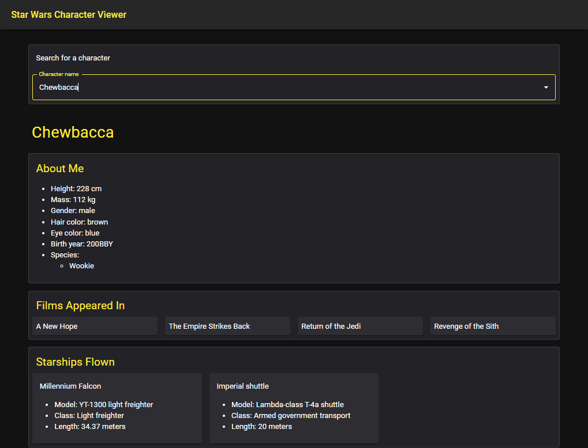

# Star Wars Character Viewer
*(Lifeway Corinth Code Challenge)*  

## Features
* Ability to search for Star Wars characters by name, facilitated by an autocomplete search box
* Display of Star Wars character info such as height, hair color, films appeared in, and starships flown
  * Each starship listing includes its model, class, and length
* Linking to individual characters by id (e.g. Luke Skywalker is located at `/1`)
* While data is loading, a progress circle is displayed

## Usage
1. Type into the `Character name` field
2. Then, select a character from the autocomplete drop-down list

## Screenshots

## Notes
* Many human characters as having species: None. This is due to the swapi.dev bug referenced [here](https://github.com/Juriy/swapi/issues/5#issuecomment-1036982287).
* As of 2/20/2022, the swapi.dev site was down; this was mitigated by using a backend gateway API.
* Characters' species is displayed as a list, as swapi.dev returns a list of species for each character. It may be possible that swapi.dev returns multiple species for certain characters. However, I have yet to run into this scenario.

## Development
*TODO*

## TODO
* development documentation
* clear search field on blur
